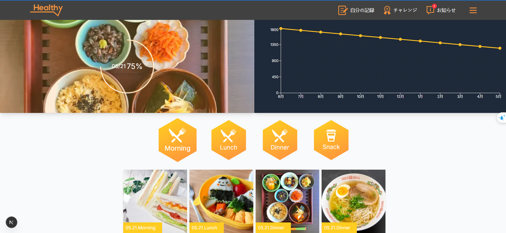

First, run the this project:

```bash
npm install

npm run dev
# or
yarn dev
# or
```

📝 Project Overview

This is a test project built with Next.js, TypeScript, Tailwind CSS, shadcn/ui, and Recharts.

Tech Stack:

Next.js for server-side rendering and routing

TypeScript for type safety and better code maintainability

Tailwind CSS and shadcn/ui for modern and responsive UI

Recharts for data visualization

Data Handling:

Data is currently stored using a local JavaScript object.

The structure is designed to be easily extendable — in the future, it can fetch data from external APIs using Redux Toolkit Query (RTK Query).

✅ Operation Verification

To verify the project:

Run the application locally.

Check that UI components render properly.

Confirm that data from the object displays and updates correctly.

Ensure charts visualize the data accurately.

Review the code structure for future integration with APIs and state management.

Screen 1: 




Screen 2:


Screen 3:


